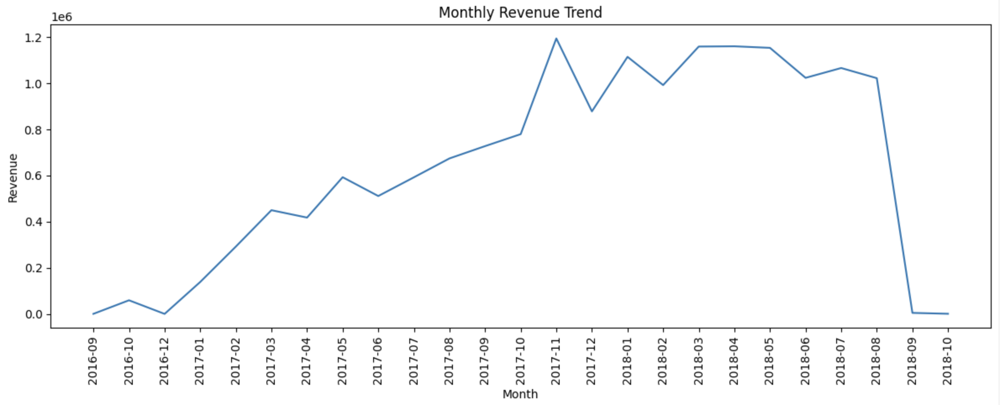
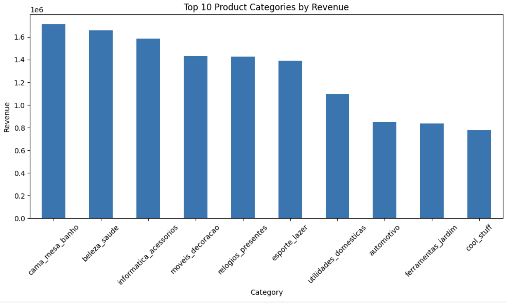
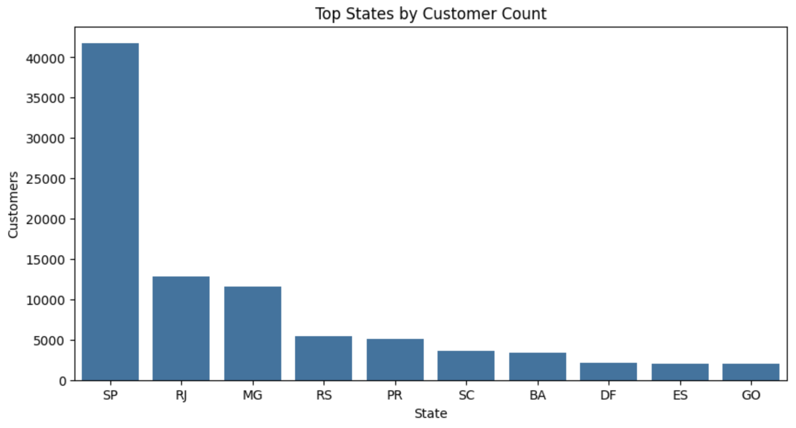
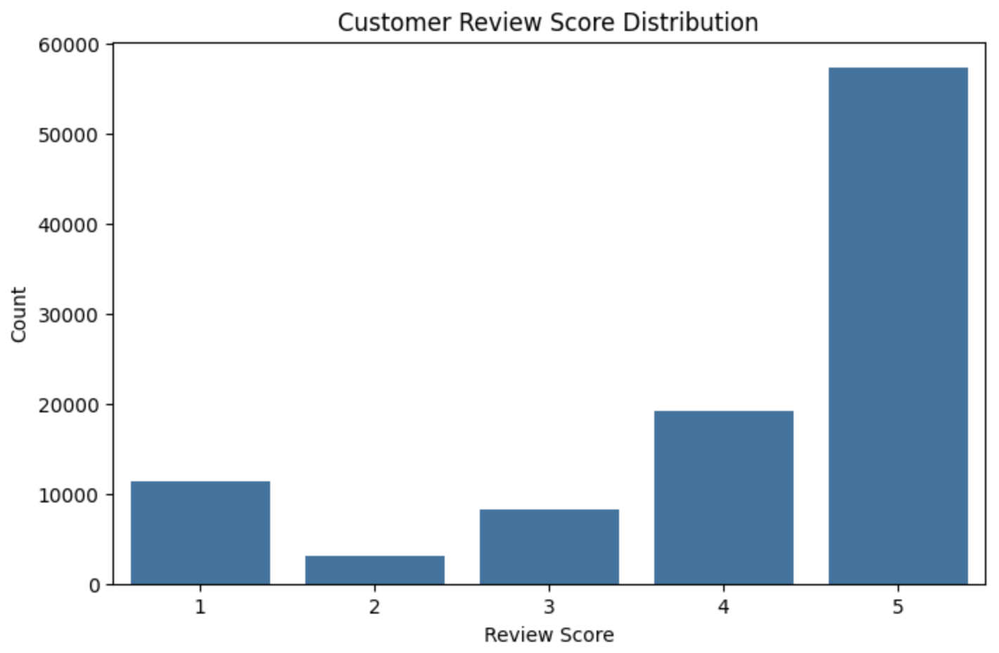

# 📊 E-Commerce Business Intelligence Suite

## 📌 Project Overview

This project analyzes customer behavior, sales performance, revenue trends, product performance, geographic customer distribution, and customer satisfaction using the Brazilian Olist E-Commerce dataset.

The goal is to transform raw e-commerce transaction data into actionable business insights that support data-driven decision-making and business growth.

---

## 🎯 Business Objectives

- Analyze revenue trends over time
- Identify top-performing product categories
- Understand customer distribution across regions
- Evaluate customer satisfaction using review scores
- Discover business growth opportunities
- Generate actionable insights for decision-makers

---

## 🛠️ Technologies Used

| Category | Technologies |
|-----------|-------------|
| Programming | Python |
| Data Analysis | Pandas, NumPy |
| Visualization | Matplotlib, Seaborn |
| Environment | Jupyter Notebook |
| Dataset | Brazilian Olist E-Commerce Dataset |

---

## 📂 Project Structure

```text
E-Commerce-Business-Intelligence-Suite/
│
├── ecommerce_analysis.ipynb
├── requirements.txt
├── README.md
│
└── images/
    ├── revenue_trend.png
    ├── top_product_categories.png
    ├── customer_distribution_by_state.png
    └── review_score_distribution.png
```

---

## 📈 Revenue Trend Analysis



### Key Insight

Revenue shows a strong upward trend throughout the analyzed period, indicating business growth and increasing customer demand.

---

## 🏆 Top Product Categories by Revenue



### Key Insight

A small number of product categories contribute a significant portion of total revenue, helping identify the most profitable business segments.

---

## 👥 Customer Distribution by State



### Key Insight

São Paulo (SP) dominates customer count, followed by Rio de Janeiro (RJ) and Minas Gerais (MG), highlighting key regional markets.

---

## ⭐ Customer Review Score Distribution



### Key Insight

Most customers provide ratings of 4 and 5 stars, indicating strong customer satisfaction and a generally positive shopping experience.

---

## 📊 Key Business Insights

### Revenue Performance

- Revenue increased significantly over time.
- Consistent growth suggests a healthy and expanding business.

### Product Performance

- Top product categories generate a substantial share of total sales.
- Revenue is concentrated among a limited number of categories.

### Customer Geography

- Customer demand is concentrated in major Brazilian states.
- Regional marketing strategies can be optimized using this information.

### Customer Satisfaction

- The majority of customers leave positive reviews.
- High review scores indicate strong service quality and customer experience.

---

## 📈 Business Impact

The insights generated from this analysis can help businesses:

- Improve sales strategy
- Optimize product offerings
- Enhance customer satisfaction
- Target high-value regions
- Support data-driven decision making

---

## 🚀 Future Improvements

- Interactive Power BI Dashboard
- Customer Segmentation Analysis
- RFM Analysis
- Sales Forecasting Models
- Recommendation Systems
- Customer Lifetime Value Prediction
- Predictive Analytics for Customer Retention

---

## 📚 Dataset Information

The project uses the Brazilian Olist E-Commerce Dataset, which contains information about:

- Customers
- Orders
- Products
- Sellers
- Payments
- Reviews
- Geolocation Data

---

## 👩‍💻 Author

**Unnati Patil**

Aspiring Data Analyst | Data Science Student

GitHub: https://github.com/Unnati22p

---

⭐ If you found this project useful, consider giving it a star.
