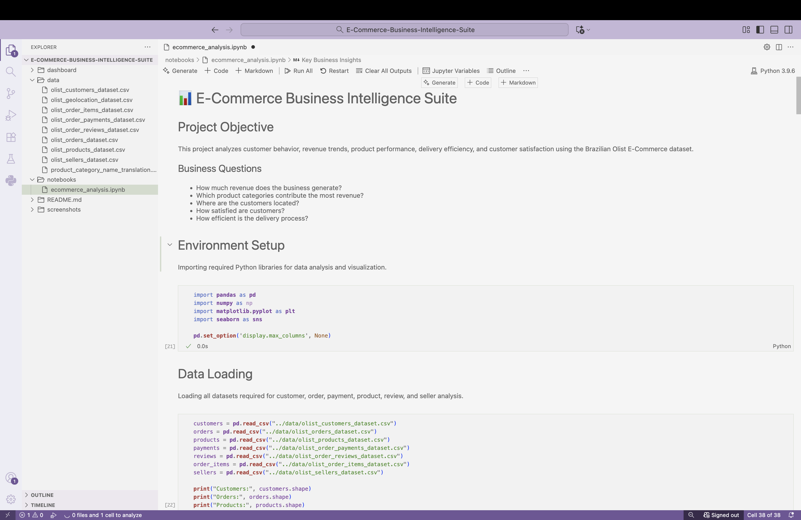
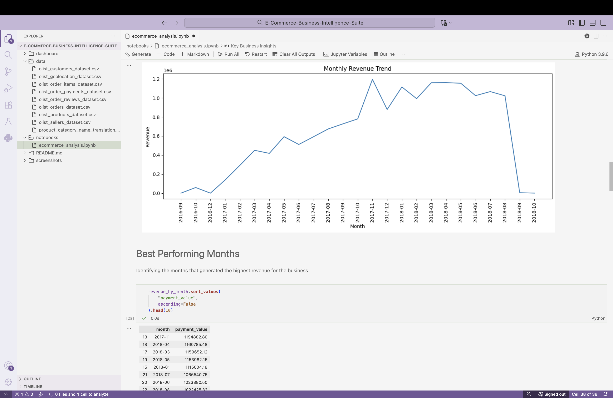
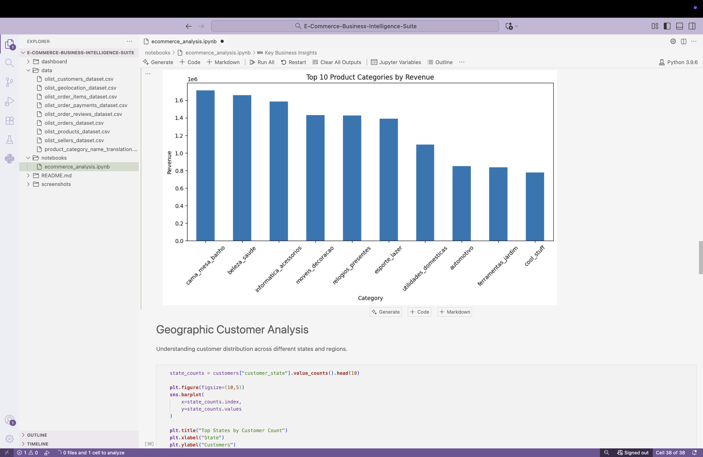
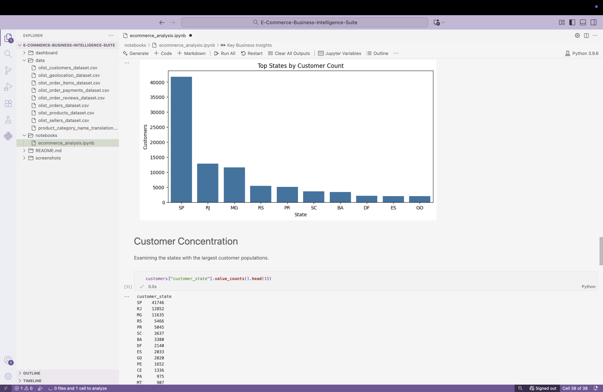
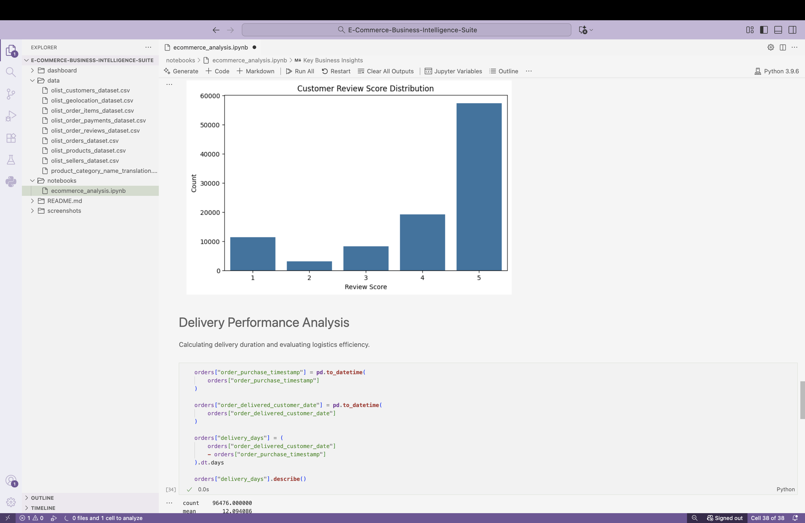

📊 E-Commerce Business Intelligence Suite

## Project Overview

This project analyzes customer behavior, revenue trends, product performance, delivery efficiency, and customer satisfaction using the Brazilian Olist E-Commerce dataset.

The goal is to generate business insights that can help improve decision-making, customer experience, and overall business performance.

## Business Questions

- How much revenue does the business generate?
- Which product categories contribute the most revenue?
- Where are customers concentrated geographically?
- How satisfied are customers?
- How efficient is the delivery process?

## Technologies Used

- Python
- Pandas
- NumPy
- Matplotlib
- Seaborn
- Jupyter Notebook

## Key Insights

- Revenue shows a strong growth trend over time.
- A small number of product categories generate most revenue.
- Customer concentration is highest in a few major states.
- Average customer review score is above 4.
- Delivery performance impacts customer satisfaction.

## Dataset

Brazilian Olist E-Commerce Public Dataset from Kaggle.

## Project Outcomes

This project demonstrates:

- Exploratory Data Analysis (EDA)
- Business Intelligence Reporting
- Data Visualization
- Customer Analytics
- Revenue Analytics
- Business Insight Generation

## Screenshots

### Project Overview

### Revenue Trend Analysis

### Top Product Categories

### Geographic Customer Distribution

### Customer Review Score Distribution

